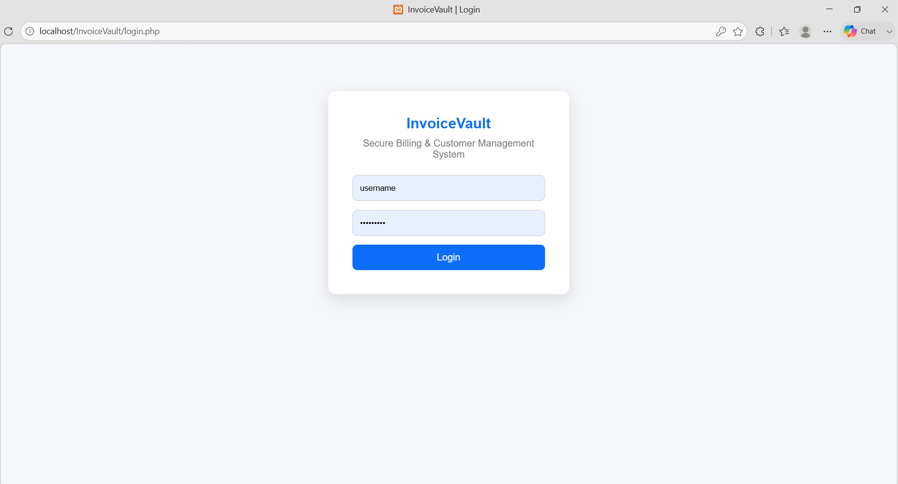
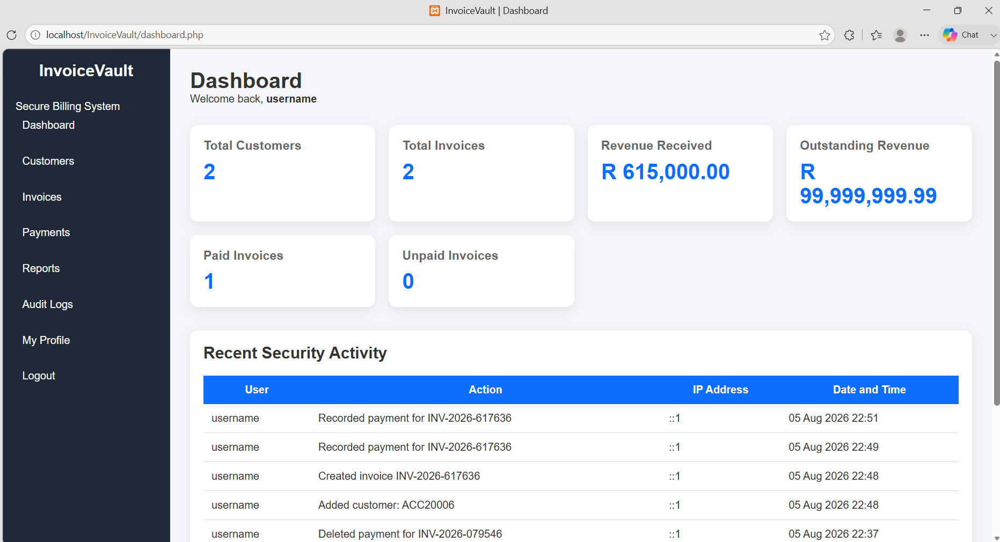
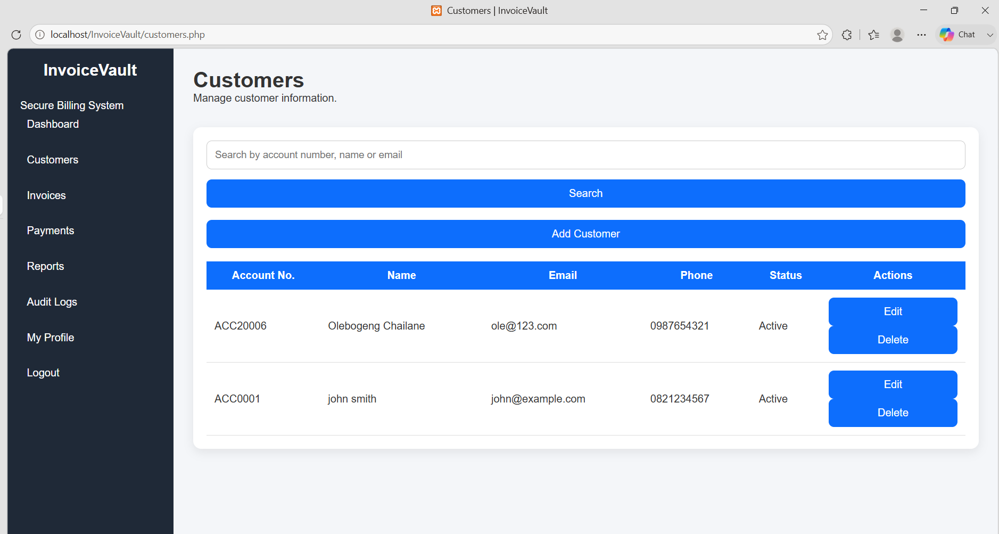
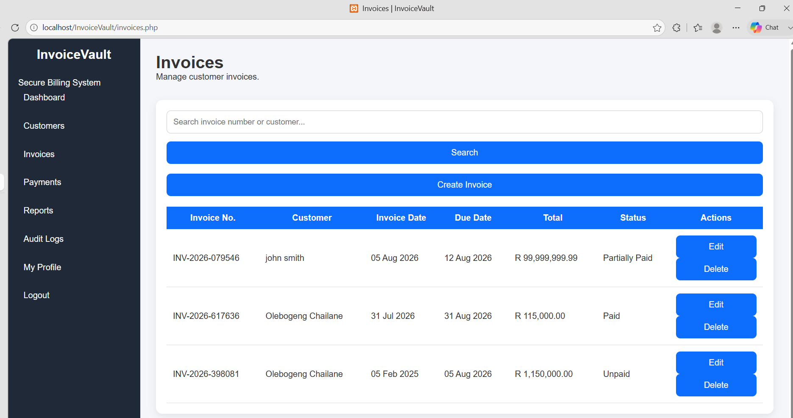
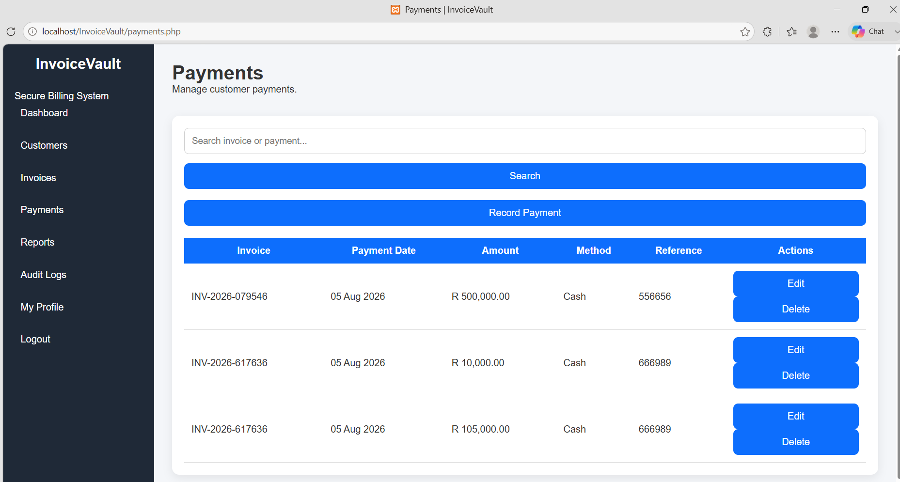
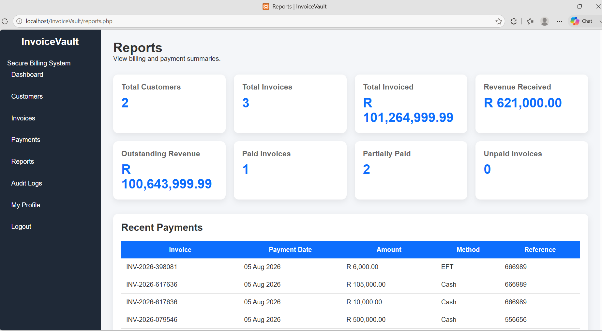
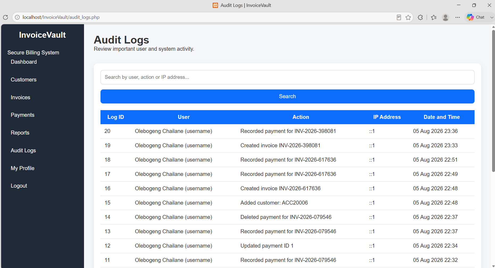
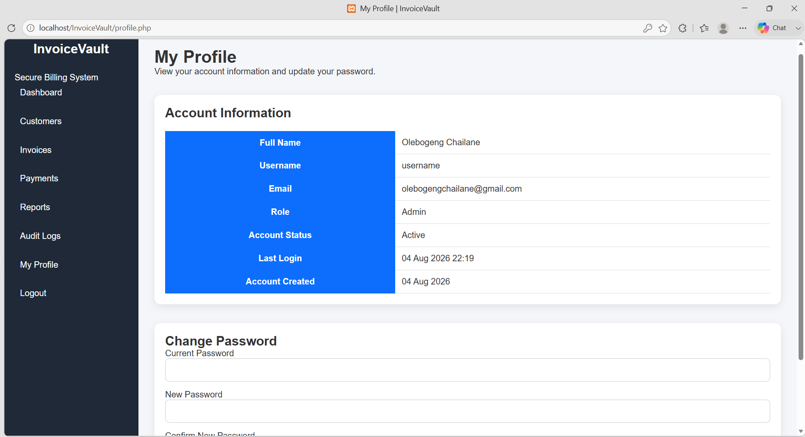

# InvoiceVault – Secure Invoice & Payment Management System

A secure invoice and payment management system built with **PHP** and **MySQL** to help organisations manage customers, invoices, payments and financial records through one secure, centralised platform.

InvoiceVault combines financial management with security-focused features such as secure authentication, password hashing, audit logging and financial reporting to demonstrate how technology can improve accountability and record keeping.

## Project Highlights

- Secure user authentication
- Password hashing using PHP
- Customer management
- Invoice management
- Payment tracking
- Automatic invoice status updates
- Overpayment prevention
- Financial dashboard
- Business reporting
- Audit logging
- Responsive interface
- Built using PHP and MySQL

## Project Motivation

One of the most valuable lessons in software development is that successful software solves real-world problems.

The inspiration for InvoiceVault came from observing financial challenges experienced by businesses, landlords, student accommodation providers and even government institutions across South Africa.

In recent years, municipalities such as the **City of Tshwane** have intensified debt collection efforts by disconnecting electricity and water services for organisations, businesses and residential properties with outstanding municipal accounts. Student accommodation providers and landlords have also faced service interruptions because of unpaid utility bills.

These situations highlighted how poor financial record keeping, missed invoices and delayed payments can quickly develop into much larger operational problems.

Many small and medium-sized organisations still rely on spreadsheets, manual filing systems or disconnected records to manage invoices and payments. As businesses grow, these methods become increasingly difficult to manage, increasing the risk of human error, lost invoices and poor financial visibility.

InvoiceVault was developed to demonstrate how a secure web application can centralise customer records, invoices, payments and reporting while maintaining accountability through detailed audit logging.

Although InvoiceVault is not intended to replace enterprise accounting software, it demonstrates how modern web technologies can improve financial management and help organisations monitor payments before financial issues become critical.

## The Problem

Many organisations continue to manage billing information manually or across multiple disconnected systems.

Common challenges include:

- Lost invoices
- Forgotten payment deadlines
- Difficulty tracking customer balances
- Poor visibility of outstanding payments
- Manual calculation errors
- Limited financial reporting
- Weak accountability between multiple users
- Inefficient record keeping
- Difficulty monitoring payment history

These challenges can lead to delayed payments, financial losses and poor decision-making.

## The Solution

InvoiceVault provides one secure platform where authorised users can:

- Manage customer information
- Create invoices
- Edit invoices
- Delete invoices
- Record customer payments
- Prevent overpayments
- Automatically update invoice payment status
- View financial summaries
- Generate reports
- Track user activity through audit logs
- Secure financial information using authenticated access

The goal is to improve financial visibility while promoting accountability, accuracy and secure record keeping.

## Key Features

### Authentication

- Secure login
- Password hashing
- Session management
- Logout functionality

### Customer Management

- Add customers
- Edit customers
- Delete customers
- Search customers

### Invoice Management

- Create invoices
- Edit invoices
- Delete invoices
- Search invoices
- Automatic invoice numbering
- Automatic VAT calculation
- Automatic payment status updates

### Payment Management

- Record payments
- Edit payments
- Delete payments
- Prevent duplicate and overpayments
- Automatic invoice balance calculation

### Dashboard

- Total customers
- Total invoices
- Revenue received
- Outstanding revenue
- Paid invoices
- Unpaid invoices
- Recent security activity

### Reports

- Customer summary
- Invoice summary
- Revenue received
- Outstanding revenue
- Recent payments

### Audit Logs

- Login history
- Customer activity
- Invoice activity
- Payment activity
- Password changes
- User activity tracking
- IP address logging

### User Profile

- View account information
- Change password securely

## Security Features

InvoiceVault implements several security practices commonly used in professional web applications.

- Password hashing
- Prepared SQL statements
- Session authentication
- Protected pages requiring login
- Input validation
- Audit logging
- Secure password updates
- Server-side processing

## Technologies Used

### Frontend

- HTML5
- CSS3

### Backend

- PHP

### Database

- MySQL

### Development Environment

- XAMPP
- phpMyAdmin
- Visual Studio Code

### Version Control

- Git
- GitHub

## Database Tables

The application uses the following database tables:

- Users
- Customers
- Invoices
- Payments
- Audit Logs

## System Modules

- Login & Authentication
- Dashboard
- Customer Management
- Invoice Management
- Payment Management
- Reports
- Audit Logs
- User Profile

## Project Screenshots

### Login

Secure authentication system using password hashing and session management.

### Dashboard

Overview of customers, invoices, revenue, outstanding balances and recent security activity.

### Customer Management

Manage customer records with search, edit and delete functionality.

### Invoice Management

Create invoices, manage payment status and monitor customer billing information.

### Payment Management

Record customer payments while automatically updating invoice balances and preventing overpayments.

### Reports

Business reporting dashboard displaying revenue summaries and recent payments.

### Audit Logs

Monitor important user activity including logins, customer updates, invoice actions and payment history.

### User Profile

View account information and securely update passwords.

## Future Improvements

Possible future enhancements include:

- PDF invoice generation
- Email invoices to customers
- Export reports to Excel
- Export reports to PDF
- Interactive dashboard charts
- Role-based access control
- Two-factor authentication
- Email payment reminders
- SMS payment reminders
- Automatic recurring invoices
- Cloud deployment
- REST API integration

## What I Learned

Developing InvoiceVault strengthened my understanding of:

- PHP web development
- MySQL database design
- CRUD application development
- Relational databases
- SQL joins
- Prepared statements
- Password hashing
- Session management
- Audit logging
- Secure authentication
- Business application development
- Financial record management
- Git and GitHub version control

Most importantly, this project reinforced one lesson that applies to every software developer:

> Great software begins by understanding a real-world problem before writing a single line of code.

## Installation

1. Clone the repository.

bash
git clone https://github.com/JordynKleopatra/InvoiceVault.git

2. Copy the project into your **XAMPP htdocs** directory.

3. Start **Apache** and **MySQL**.

4. Import the provided **invoicevault.sql** database using phpMyAdmin.

5. Open your browser and visit:

http://localhost/InvoiceVault

## License

This project was developed for educational and portfolio purposes.

Developed by **Olebogeng Chailane**